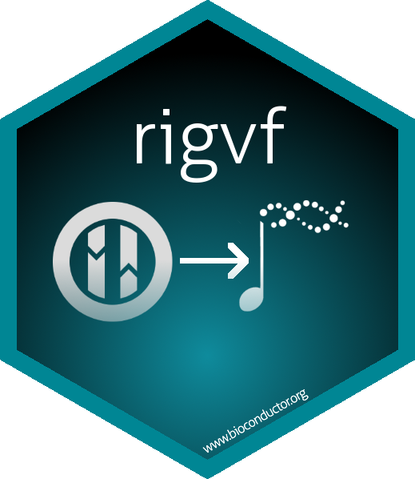

# rigvf: IGVF Catalog from R 

*rigvf* provides access the Impact of Genomic Variation on Function
(IGVF) Catalog from within R/Bioconductor, allowing integration with
Bioconductor resources, classes, and methods.

Only limited functionality is currently implemented, mostly centered
around associations among genetic variants, genomic elements, and genes.

## Installation

Install the development version from
[GitHub](https://github.com/IGVF/rigvf) with:

``` r

## install.packages("BiocManager") # if not installed
BiocManager::install("IGVF/rigvf")
```

## Using `rigvf`

See the [Accessing data from the IGVF
Catalog](https://IGVF.github.io/rigvf/articles/rigvf.html) vignette for
basic use.

See
[`?catalog_queries`](https://IGVF.github.io/rigvf/reference/catalog_queries.md)
and
[`?db_queries`](https://IGVF.github.io/rigvf/reference/db_queries.md)
for example functions for accessing IGVF data through the Catalog API
and ArangoDB API, respectively.

## Data license

For IGVF Catalog data license, see the [IGVF policy
page](https://data.igvf.org/policies/).
